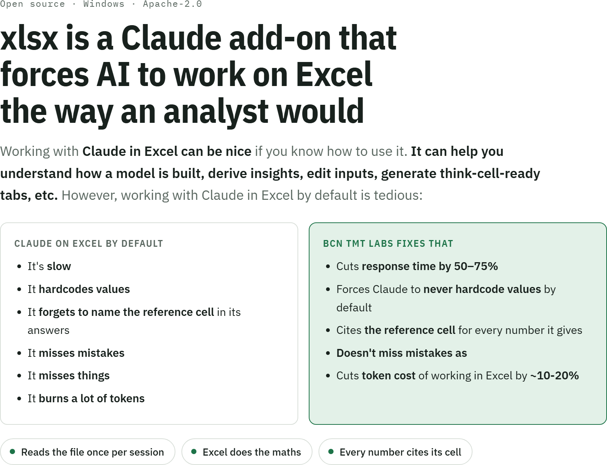
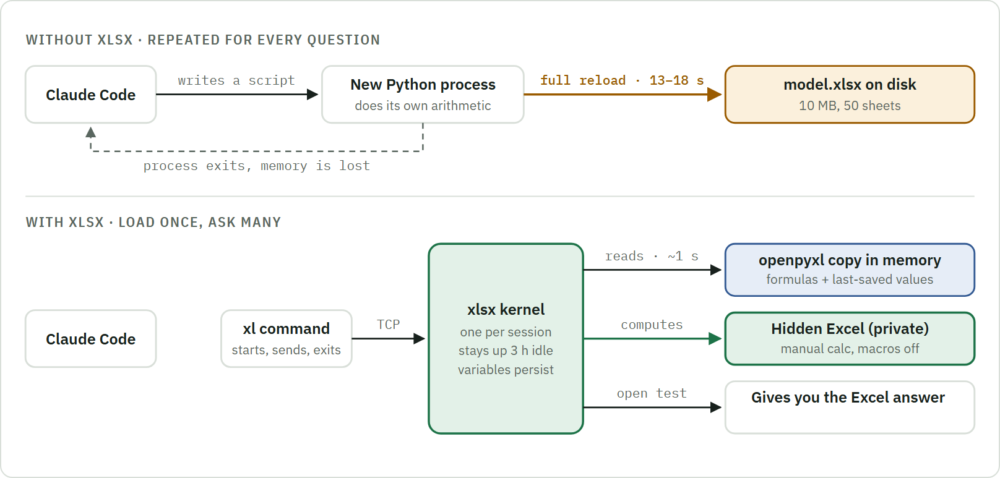
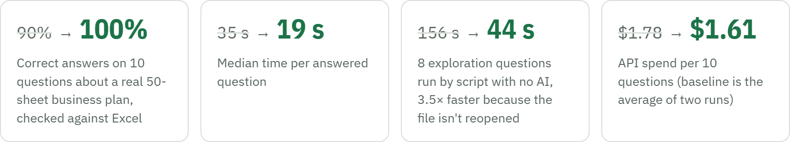
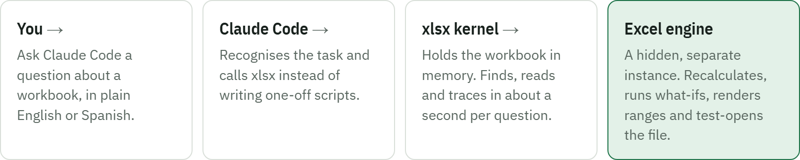

<picture>
  <source media="(prefers-color-scheme: dark)" srcset="docs/readme/hero-dark.png">
  
</picture>

**Needs:** Windows · desktop Excel · [Claude Code](https://claude.com/claude-code) &nbsp;|&nbsp;
[How to install](#how-to-install) · [Commands](#commands) · [Install guide](INSTALL.md) · [Overview page](https://ignacioelias.github.io/xl/)

## The root of the problem

Claude Code has no built-in way to read a spreadsheet. When you ask about a workbook, it writes a
short Python script using **openpyxl** (a library that unzips the .xlsx and reads its XML), runs
it, reads what it prints, and then the script ends. For the next question it writes a new script,
which starts a new Python process that loads the whole file again. On a 50-sheet business plan
that takes 13 to 18 seconds, every time.

openpyxl can see formulas as text, and it can see the values Excel stored the last time someone
saved the file. It cannot calculate. So when a question needs a number that isn't already stored
("what if churn were 5%?"), plain Claude either rebuilds the model's logic in Python, where it can
easily get the arithmetic wrong, or trusts stored values that may be out of date.

**xlsx changes two things.** The workbook opens once and stays in memory, so each follow-up question
is answered in about a second. And any number that matters is calculated by Excel itself, running
hidden in the background, so the answer is what Excel would show, with the cell reference attached
(for example `Summary!D42`) so you can check it yourself.

<picture>
  <source media="(prefers-color-scheme: dark)" srcset="docs/readme/diagram-dark.png">
  
</picture>

*With xlsx, the kernel loads the file once and reloads it only when the file's date or size
changes. Reading goes to openpyxl, and any number that has to be calculated goes to Excel. Before
a file is handed over, a throwaway Excel with alerts switched on opens it to confirm there is no
repair prompt.*

## What you can ask it to do

<picture>
  <source media="(prefers-color-scheme: dark)" srcset="docs/readme/cards-dark.png">
  
</picture>

Claude picks xlsx up on its own. You don't need to learn any commands.

## Why xlsx matters

Same questions, same model, without and with xlsx.

<picture>
  <source media="(prefers-color-scheme: dark)" srcset="docs/readme/stats-dark.png">
  
</picture>

### What the evidence actually shows

A benchmark of 10 questions on one real 50-sheet client plan (636k formulas), each answer checked
against Excel by script. Claude Sonnet ran headless, once with Python and openpyxl only and once
with xlsx.

| Measure | Without xlsx | With xlsx | What it means |
|---|---|---|---|
| Correct answers | 18 / 20 | 10 / 10 final run<br>35 / 35 all runs | Both misses were the same question: "which cells reference `Summary!R45`?" Answering it means scanning every formula in 50 sheets. Plain Python started a background scan that never reported back, while xlsx answers it from its prebuilt index. The accuracy gain comes from this one type of question, the reverse lookup. |
| Turns per question (median) | 3 to 3.5 | 3 final run<br>5 to 8 earlier | Without xlsx, Claude also needed about 3 turns. The drop to 3 with xlsx came from rewriting the skill that teaches Claude the tool. |
| Median time per question | 35 to 39 s | 19 s | Roughly half. |
| Cost per 10 questions | $1.72 to $1.84 | $1.61 | About 10% lower. |
| Time to answer the 10 questions | 610 to 1,021 s | 260 s | 57 to 75% faster. |

Indicative: one model, one model family, one or two runs per condition, September 2026. The model
is confidential, so these runs can't be reproduced from this repository. The scripted load test
behind the 156 s to 44 s figure (8 questions, no AI) is
[`bench/bench_repl_vs_scripts.py`](bench/bench_repl_vs_scripts.py).

## The 18 checks it performs

They mirror errors found in real financial models.

<picture>
  <source media="(prefers-color-scheme: dark)" srcset="docs/readme/checks-dark.png">
  
</picture>

Fourteen more rules exist in the code but are switched off by default (`OFF_IDS` in
[`xl/lint.py`](xl/lint.py)). `bench/make_fixture.py --check` fails if an active rule stays silent
on its planted defect or a switched-off rule fires.

## How it works

<picture>
  <source media="(prefers-color-scheme: dark)" srcset="docs/readme/flow-dark.png">
  
</picture>

After Claude edits a workbook, a quick check runs automatically and the findings go back to Claude
before it reports the work as done. Excel runs in a private hidden instance, so your own Excel
windows are never touched. Originals are never saved over by default: edits and what-ifs happen on
working copies, and Claude only changes the original if you tell it to.

xlsx is a standalone command-line program (the command is `xl`) with its own persistent kernel, so it keeps working if a
given chat tool is unavailable. Every command runs the same way when typed by hand in a plain
terminal, although using it that way takes some Python. Claude Code is one way to drive it: the
`xl-repl` skill teaches Claude when to reach for xlsx and gives it the full API before its first
call, and a hook runs a quick check after every edit. It is an independent open-source project,
not an official Anthropic product.

**Under the hood.** The `xl` command is a thin client that passes Claude's script to a long-lived
Python kernel (one per session, local TCP with a token, 3 h idle timeout) where the workbook is
already loaded and variables persist. The kernel reloads a file only when its date or size
changes. Calculation, what-ifs and rendering go to a hidden Excel that xlsx starts itself with
manual calculation, macros off and alerts off; the open test uses a separate Excel with alerts on.
The skill sets four rules: check for errors after every write, take numbers from Excel, cite
`Sheet!Address` for every figure, and never edit an original in place.

## How to install

**You need:** Windows 10 or 11, desktop Excel and [Claude Code](https://claude.com/claude-code).
The installer adds Python 3.14 if it is missing. About 5 minutes.

**1. Open Claude Code in any folder and paste this prompt:**

```text
Install xl on this machine and confirm it works.
1. Clone https://github.com/Ignacioelias/xl into %USERPROFILE%\tools\xl. If that folder already holds a clone of this repository, run git pull there instead. If it exists and is not a clone, stop and ask me.
2. Run: powershell -ExecutionPolicy Bypass -File "%USERPROFILE%\tools\xl\install.ps1" -NoPause
3. It must end with six PASS lines and "All checks passed." On any FAIL, show me the exact output and stop; do not try to fix it yourself.
4. Run `xl help` (fallback: py -3.14 "%USERPROFILE%\tools\xl\xlcli.py" help) and confirm it prints the command list.
5. Tell me in three lines that xl is installed and what I can ask you now. Do not change anything else on my machine.
```

**2. Claude runs the installer for you.** It installs the Python packages, registers the two
Claude Code skills (xl and think-cell feeds) and the hook, adds the `xl` command, and runs six
checks with Excel. You want to see this:

```text
[7/7] Checks
   PASS  Python packages (openpyxl, pywin32, pillow)
   PASS  Excel reachable through COM
   PASS  xl kernel starts and answers
   PASS  Lint fixture: every rule fires on its planted defect
   PASS  Excel opens the fixture without a repair prompt
   PASS  Think-cell feeds: injected values read by Excel, no repair

   All checks passed.
```

**3. Use it.** Start Claude Code in a folder with a workbook and ask: *"What is in this model, and
does it have any errors?"*

To install by hand, see what the installer changes on your machine, update or uninstall, read
[INSTALL.md](INSTALL.md). If a check fails, please
[open an issue](https://github.com/Ignacioelias/xl/issues) with the full output.

## Commands

Everything also works by hand; `xl help` prints the full API.

| Command | What it does |
|---|---|
| `xl exec` | Run Python in the kernel, with the workbook helpers available (the main entry point) |
| `xl describe`, `sheets`, `find`, `find-rows`, `lookup`, `read` | Explore a workbook |
| `xl precedents`, `dependents`, `trace` | Follow formulas backwards or forwards |
| `xl lint` | The 18 structural checks, no Excel needed |
| `xl calc [--verify]` | Full recalculation in Excel; lists error cells and stale cached values |
| `xl scenario`, `sweep` | What-ifs in Excel, nothing saved |
| `xl render [--diff]` | PNG of a range, optionally compared with a baseline |
| `xl check-open` | Opens the file with alerts on and reports any repair prompt |
| `xl inject`, `calcpr` | Write cached values into formula cells and set calculation options, without Excel |
| `xl status`, `stop` | Manage kernels |

Also included, experimental and not covered by the install checks: `xl pptx-lint` and
`xl pptx-render` for PowerPoint decks.

## Tests

```powershell
py -3.14 -m compileall -q xl
py -3.14 bench/make_fixture.py "$env:LOCALAPPDATA\xl\work\fixture_defects.xlsx" --check
py -3.14 bench/inject_check.py "$env:LOCALAPPDATA\xl\work\inject_check"
py -3.14 bench/witan_cases.py
py -3.14 skills/thinkcell-chart-feeds/scripts/selftest.py
```

The README images are rendered from [`docs/index.html`](docs/index.html) by
`py -3.14 docs/readme/render.py`.

## Limits

- Windows, desktop Excel and Python 3.14 only.
- Memory: a 10.7 MB workbook holds about 9.7 GB in the kernel (formulas, values and the reference index).
- Each `xl` call has a floor of about 1.2 s for Python start-up.
- Lint reads the file without recalculating; `xl calc` is the authority.
- `render` goes through the Windows clipboard. Text on the clipboard is restored afterwards; rich content is not.

## Credits and licence

The design follows the public research log by [Witan Labs](https://github.com/witanlabs/research-log).
xlsx is an independent project and is not affiliated with Anthropic or Witan Labs.

Apache License 2.0 · © 2026 Ignacio Elías. See [LICENSE](LICENSE) and [NOTICE](NOTICE).
